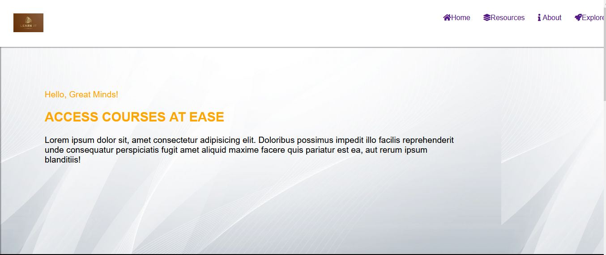

# Learn It

The project is an initiative to train users in the development of various skill.

The goal is to build a very interactive and easy-to-follow free tutorial course with mobile app integration

## Built With:
 - HTML
 - CSS
 - JavaScript.

Libraries such as Bootstrap may be used.

## Live Demo
<!-- Link to deployed page will be showed here -->

Quick note: Deployment is rooted to the master branch hence unmerged changes may not show.

👤 **Author1** 
  - linkedIn: https://www.linkedin.com/in/appiah-maxwell-0212b41a1/
  - GitHub: https://github.com/i-max-xi

## Show your support
Give a ⭐️ if you like this project!

## Acknowledgement:
   - Big thanks to Microverse.
   - Credits to Cindy Shin for such an awesome design
   - Hat tip to W3css and every website that trained me to code.
   - etc.

## 📝 License
   This project is MIT licensed.
